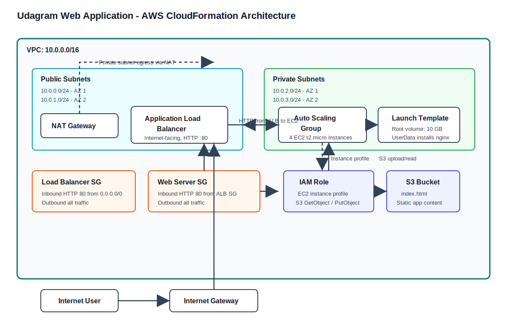

# udagra-webapp

# CD12352 - Infrastructure as Code Project Solution
# [TCHOUA TCHATOUO Bienvenue]

## Overview
This project deploys a highly available web application infrastructure on AWS using CloudFormation.

## Architecture
The infrastructure includes:
- 1 VPC
- 2 public subnets
- 2 private subnets
- 1 Internet Gateway
- 1 NAT Gateway
- 1 Application Load Balancer
- 1 Auto Scaling Group with 4 EC2 instances
- 1 S3 bucket for static content
- Security Groups and IAM Role



Traffic flow: Internet users reach the Internet Gateway and public Application Load Balancer. The ALB forwards HTTP traffic to EC2 instances in private subnets through the web server security group. Private instances use the NAT Gateway for outbound package installation and use an IAM instance profile to upload/read `index.html` from the S3 bucket.

## Files
- `network.yml`: network infrastructure
- `udagram.yml`: application infrastructure
- `network-parameters.json`: parameters for network stack
- `udagram-parameters.json`: parameters for application stack
- `create.sh`: create both stacks
- `update.sh`: update both stacks
- `delete.sh`: delete both stacks
- `architecture-diagram.svg`: architecture diagram
- `screenshot.png`: browser proof of the deployed load balancer URL

## Prerequisites
- AWS CLI configured
- Valid AMI ID in `udagram-parameters.json`

## Deploy
```bash
chmod +x create.sh update.sh delete.sh
./create.sh
```

## Working Test
Live Load Balancer URL:

```text
http://udagra-WebAp-YioHoDqd17gY-818578144.us-east-1.elb.amazonaws.com
```

Expected response:

```text
It works! Udagram, Udacity
```

Stack outputs from the deployment:

```text
udagram-network: CREATE_COMPLETE
udagram-app: UPDATE_COMPLETE
LoadBalancerURL: http://udagra-WebAp-YioHoDqd17gY-818578144.us-east-1.elb.amazonaws.com
```

The S3 bucket created by the stack is:

```text
udagram-udagram-508084534011
```

The EC2 UserData uploads `index.html` to that bucket and copies the same file into the nginx document root on each web server.
